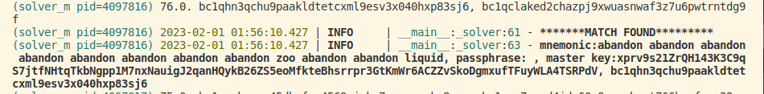

##### BIP39 seed solver

- `TODO`: partition/optimize multi-processing
- `Don't trust, verify` : potentially sub-optimal accuracy and performance 
- Ref: [mnemonic seed](https://learnmeabitcoin.com/technical/mnemonic) | [hd-wallets](https://learnmeabitcoin.com/technical/hd-wallets) | [BIP39](https://github.com/bitcoin/bips/blob/master/bip-0039.mediawiki)
- Cryptography dependencies(included in `requirements.txt`): [cryptotools](https://github.com/mcdallas/cryptotools) | [mnemonic](https://github.com/trezor/python-mnemonic)
- The library [ray](https://stackoverflow.com/questions/70854334/run-a-python-function-on-a-gpu-using-ray) enables multi-processing for cpus(tested) and gpus(untested)


---
##### Setup

- Clone and install dependencies:
```
git clone https://github.com/ns-xvrn/seed_solver.git &&
cd seed_solver &&
pip install -r requirements.txt &&
```
- Edit `src/solver.py`: set target address, words, checksum, passphrase and make sure to modify address descriptor and address indexes
- Set `is_shuffled=True` if order of words is unknown
- Set `num_cpus`/`num_gpus` accordingly
- Use `'?'` for missing words/checksum
- Run: `python3 solver.py`

